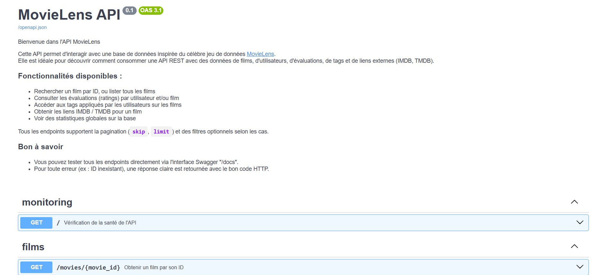
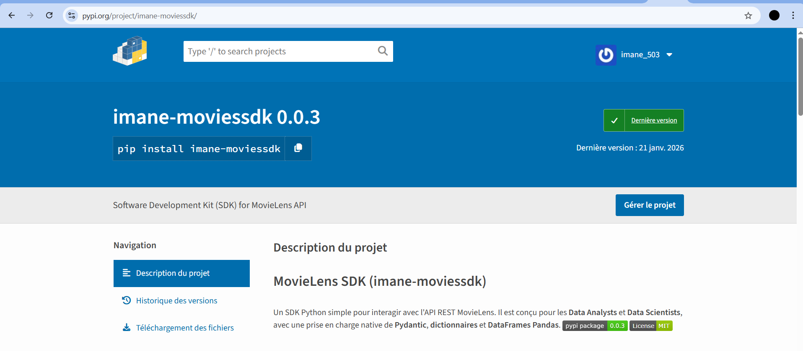

# 🎬 MovieLens API — Backend REST, SDK Python & Docker


Une **API REST complète** construite de A à Z autour du dataset **MovieLens**, avec une architecture robuste et industrialisée : base de données SQLite, **SDK Python publié sur PyPI**, containerisation **Docker**, documentation interactive et tests automatisés.

📦 **SDK sur PyPI** : [`pip install imane-moviessdk`](https://pypi.org/project/imane-moviessdk/)
📚 **Documentation interactive** : disponible sur `/docs` une fois l'API lancée (Swagger / OpenAPI 3.1)

> ℹ️ Ce repo couvre la **Phase 1** du projet (backend). La Phase 2 — une application Streamlit d'analyse et de visualisation des films consommant cette API — est disponible dans un repo séparé : [film_analytics](https://github.com/imane-el-arrach/films-analytics).

---

## 🖼️ Aperçu



*L'API expose des endpoints pour rechercher des films, consulter les évaluations, accéder aux tags, récupérer les liens IMDB/TMDB et obtenir des statistiques globales — tous avec pagination et gestion d'erreurs claire*


*Le SDK `imane-moviessdk`, conçu pour les Data Analysts et Data Scientists, avec prise en charge native de Pydantic, dictionnaires et DataFrames Pandas*

## 🧱 Ce qui a été construit

- **Modélisation de la base de données** en SQL à partir des fichiers CSV MovieLens (films, utilisateurs, évaluations, tags, liens IMDB/TMDB), stockée dans **SQLite**
- **API RESTful avec FastAPI** : recherche de films par ID, listing, évaluations par utilisateur/film, tags, liens externes, statistiques globales — avec pagination (`skip`, `limit`) et filtres optionnels
- **Validation des données** avec **Pydantic**
- **Gestion des requêtes** à la base de données avec **SQLAlchemy**
- **SDK Python** (`imane-moviessdk`) publié sur **PyPI**, pensé pour les Data Analysts/Data Scientists, avec support natif des DataFrames Pandas
- **Containerisation Docker** avec **multi-stage builds** pour des images optimisées
- **Tests unitaires et d'intégration** (Pytest) couvrant l'API et l'intégration API-SDK
- **Documentation interactive** Swagger/OpenAPI générée automatiquement

## 🔧 Installation & lancement

**Avec Docker (recommandé) :**
```bash
git clone https://github.com/imane-el-arrach/movie_backend.git
cd movie_backend

docker build -t movielens-api .
docker run -p 8000:8000 movielens-api
```
La documentation interactive est alors disponible sur `http://localhost:8000/docs`

**En local (sans Docker) :**
```bash
python -m venv .venv
source .venv/bin/activate  # Windows : .venv\Scripts\activate

pip install -r requirements.txt
uvicorn api.main:app --reload
```

**Utiliser le SDK :**
```bash
pip install imane-moviessdk
```

**Lancer les tests :**
```bash
pytest
```

## 🏗️ Comment fonctionne l'architecture

1. Les **utilisateurs de l'API** interagissent via le **SDK Python** (`imane-moviessdk`), qui simplifie l'envoi de requêtes
2. Les données transitent par **Pydantic**, qui valide leur format
3. **FastAPI** reçoit la requête, orchestre le traitement et décide de l'action à effectuer
4. **SQLAlchemy** traduit les opérations en requêtes compréhensibles par la base
5. **SQLite** stocke et restitue les données de manière structurée

## 🚧 Défis techniques relevés

- **Packaging PyPI** : première publication d'un package Python, gestion des dépendances
- **Dockerisation** : optimisation d'image via des builds multi-stage
- **Tests** : mise en place de tests systématiques avant déploiement
- **Documentation** : Swagger interactif + README détaillé

## 📊 Dataset

Le [dataset MovieLens](https://grouplens.org/datasets/movielens/) (GroupLens) contient des informations sur des films, des évaluations d'utilisateurs et des tags — largement utilisé en recherche sur les systèmes de recommandation.

```

## 🔜 Suite du projet

Cette API est consommée dans la **Phase 2** — une application Streamlit d'analyse et de visualisation interactive des films (tendances de notation, genres populaires, recherche avancée) : voir [film_analytics](https://github.com/imane-el-arrach/films-analytics).

## 👩‍💻 Auteure

**Imane El Arrach** — Élève-ingénieure en Génie Informatique, spécialité Ingénierie des Données & IA, ENSA Safi
[LinkedIn](https://www.linkedin.com/in/imane-el-arrach-7a88ab325/) · [GitHub](https://github.com/imane-el-arrach)


